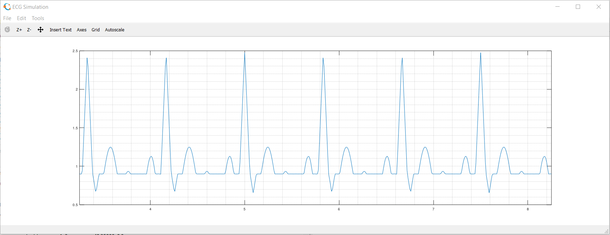

# Electrocardiogram (ECG) Simulation

ECG Simulation Using Matlab

## ECG
>Electrocardiography is the process of producing an electrocardiogram (ECG or EKG), a recording – a graph of voltage versus time – of the electrical activity of the heart using electrodes placed on the skin.

## Forked from
karthik raviprakash (2020). ECG simulation using MATLAB (https://www.mathworks.com/matlabcentral/fileexchange/10858-ecg-simulation-using-matlab), MATLAB Central File Exchange. Retrieved January 25, 2020.

## Result
